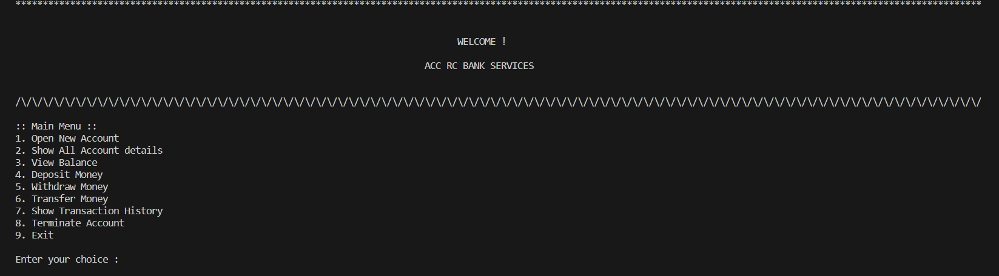

# Bank Management System

This project is built in C++.
All the code is beautifully written with comments in readable form

## Authors

- [@Dhruv251004](https://github.com/Dhruv251004)

## Documentation

Currently it has 9 features and you will be asked to choose any of them by mentioning it's sequence number. After that it will process your request.
Note that the program is built such that it can remember all the account details even after the program is terminated. So next time you use it, you can start from all your previous details

Note: Do not alter the files created by the program

## Features

- Open a new Account
- Show All account details
- View Balance
- Deposit money
- Withdraw money
- Transfer money
- Show Transaction History
- Terminate Account
- Exit

## Screenshot

